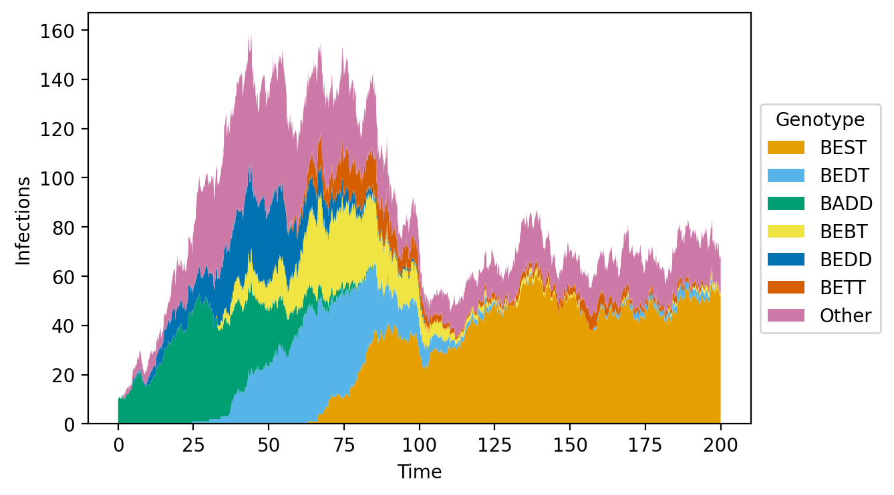
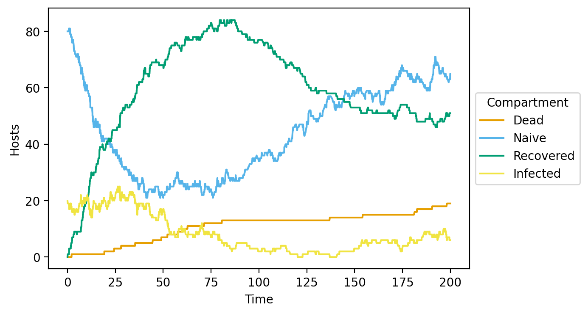
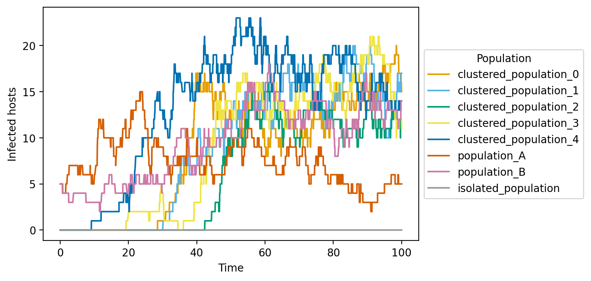
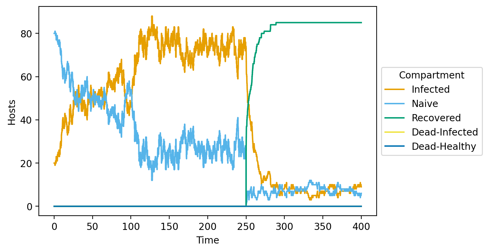
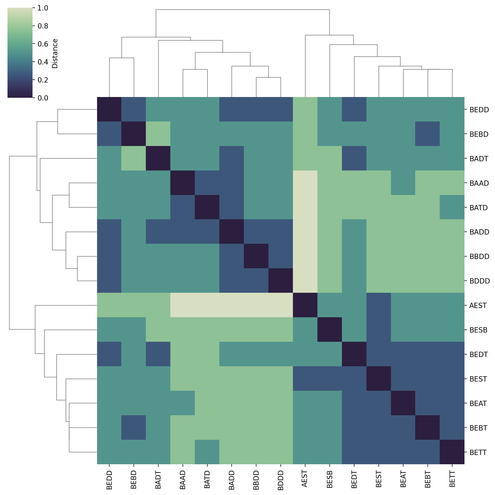
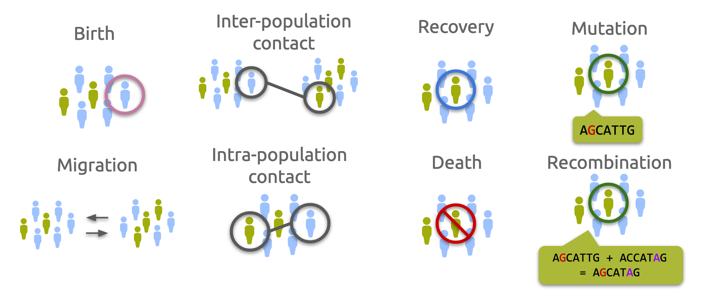
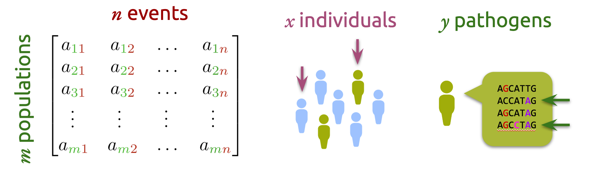

Opqua 
=====

**opqua** (opkua, upkua)
\[[Chibcha/muysccubun](https://en.wikipedia.org/wiki/Chibcha_language)\]

**I.** *noun*. ailment, disease, illness

**II.** *noun*. cause, reason \[*for which something occurs*\]

_Taken from D. F. Gómez Aldana's
[muysca-spanish dictionary](http://muysca.cubun.org/opqua)_.

## Contents
- [About](#about)
- [Example Plots](#example-plots)
- [Requirements and Installation](#requirements-and-installation)
- [Usage](#usage)
- [How Does Opqua Work?](#how-does-opqua-work)
- [Model Documentation](#opqua-model-documentation)

## About

### Opqua is an epidemiological modeling framework for pathogen population genetics and evolution.

Opqua stochastically simulates pathogens with distinct, evolving genotypes that
spread through populations of hosts which can have specific immune profiles.

Opqua is a useful tool to test out scenarios, explore hypotheses, make
predictions, and teach about the relationship between pathogen evolution and
epidemiology.

Among other things, Opqua can model
- host-host, vector-borne, and vertical transmission
- pathogen evolution through mutation, recombination, and/or reassortment
- host recovery, death, and birth
- metapopulations with complex structure and demographic interactions
- interventions and events altering demographic, ecological, or evolutionary
parameters
- treatment and immunization of hosts or vectors
- influence of pathogen genome sequences on transmission and evolution, as well
as host demographic dynamics
- intra- and inter-host competition and evolution of pathogen strains across
user-specified adaptive landscapes

Check out the `changelog` file for information on recent updates.

Opqua has been used in-depth to study [pathogen evolution across fitness valleys](https://github.com/pablocarderam/fitness_valleys_opqua).
Check out the preprint on [biorXiv](https://doi.org/10.1101/2021.12.16.473045).

Opqua is developed by [Pablo Cárdenas](https://pablo-cardenas.com) and Mauricio
Santos-Vega.
Follow their science antics on Twitter at
[@pcr_guy](https://twitter.com/pcr_guy) and
[@msantosvega](https://twitter.com/msantosvega).

Opqua is [available on PyPI](https://pypi.org/project/opqua/) and is distributed
under an [MIT License](https://choosealicense.com/licenses/mit/).

## Example Plots

These are some of the plots Opqua is able to produce, but you can output the
raw simulation data yourself to make your own analyses and plots. These are all
taken from the examples in the `examples/tutorials` folder—try them out
yourself! See the
[Requirements and Installation](#Requirements and Installation) and
[Usage](#Usage) sections for more details.

#### Population genetic composition plots for pathogens
An optimal pathogen genome arises and outcompetes all others through intra-host
competition. See `fitness_function_mutation_example.py` in the
`examples/tutorials/evolution` folder.


#### Host/vector compartment plots
A population with natural birth and death dynamics shows the effects of a
pathogen. "Dead" denotes deaths caused by pathogen infection. See
`vector-borne_birth-death_example.py` in the `examples/tutorials/vital_dynamics`
folder.


#### Plots of a host/vector compartment across different populations in a metapopulation
Pathogens spread through a network of interconnected populations of hosts. Lines
denote infected pathogens. See
`metapopulations_migration_example.py` in the
`examples/tutorials/metapopulations` folder.


#### Host/vector compartment plots
A population undergoes different interventions, including changes in
epidemiological parameters and vaccination. "Recovered" denotes immunized,
uninfected hosts.
See `intervention_examples.py` in the `examples/tutorials/interventions` folder.


#### Pathogen phylogenies
Phylogenies can be computed for pathogen genomes that emerge throughout the
simulation. See `fitness_function_mutation_example.py` in the
`examples/tutorials/evolution` folder.


For advanced examples (including multiple parameter sweeps), check out
[this separate repository](https://github.com/pablocarderam/fitness-valleys-opqua)
(preprint forthcoming).

## Requirements and Installation

Opqua runs on Python. A good place to get the latest version it if you don't
have it is [Anaconda](https://www.anaconda.com/distribution/).

Opqua is [available on PyPI](https://pypi.org/project/opqua/) to install
through `pip`, as explained below.

If you haven't yet, [install pip](https://pip.pypa.io/en/stable/installing/):
```bash
curl https://bootstrap.pypa.io/get-pip.py -o get-pip.py
python get-pip.py
```

Install Opqua by running

```bash
pip install opqua
```

The pip installer should take care of installing the necessary packages.
However, for reference, the versions of the packages used for opqua's
development are saved in `requirements.txt`

## Usage

To run any Opqua model (including the tutorials in the `examples/tutorials`
folder), save the model as a `.py` file and execute from the console using
`python my_model.py`.

You may also run the models from a notebook environment
such as [Jupyter](https://jupyter.org/) or an integrated development environment
(IDE) such as [Spyder](https://www.spyder-ide.org/), both available through
[Anaconda](https://www.anaconda.com/distribution/).

### Minimal example

The simplest model you can make using Opqua looks like this:

```python
# This simulates a pathogen with genome "AAAAAAAAAA" spreading in a single
# population of 100 hosts, 20 of which are initially infected, under example
# preset conditions for host-host transmission.

from opqua.model import Model

my_model = Model()
my_model.newSetup('my_setup', preset='host-host')
my_model.newPopulation('my_population', 'my_setup', num_hosts=100)
my_model.addPathogensToHosts( 'my_population',{'AAAAAAAAAA':20} )
my_model.run(0,100)
data = my_model.saveToDataFrame('my_model.csv')
graph = my_model.compartmentPlot('my_model.png', data)
```

For more example usage, have a look at the `examples` folder. For an overview
of how Opqua models work, check out the Materials and Methods section on the
manuscript
[here](https://www.biorxiv.org/content/10.1101/2021.12.16.473045v1.full). A
summarized description is shown below in the
[How Does Opqua Work?](#how-does-opqua-work) section.
For more information on the details of each function, head over to the
[Model Documentation](#opqua-model-documentation) section.

## How Does Opqua Work?

### Basic concepts

Opqua models are composed of populations containing hosts and/or vectors, which
themselves may be infected by a number of pathogens with different genomes.

A genome is represented as a string of characters. All genomes must be of the
same length (a set number of loci), and each position within the genome can have
one of a number of different characters specified by the user (corresponding to
different alleles). Different loci in the genome may have different possible
alleles available to them. Genomes may be composed of separate chromosomes,
separated by the "/" character, which is reserved for this purpose.

Each population may have its own unique parameters dictating the events that
happen inside of it, including how pathogens are spread between its hosts and
vectors.

### Events

There are different kinds of events that may occur to hosts and vectors in
a population:

- contact between an infectious host/vector and another host/vector in the same
population (intra-population contact) or in a different population ("population
contact")
- migration of a host/vector from one population to another
- recovery of an infected host/vector
- birth of a new host/vector from an existing host/vector
- death of a host/vector due to pathogen infection or by "natural" causes
- mutation of a pathogen in an infected host/vector
- recombination of two pathogens in an infected host/vector



The likelihood of each event occurring is determined by the population's
parameters (explained in the [newSetup](#newSetup) function documentation) and
the number of infected and healthy hosts and/or vectors in the population(s)
involved. Crucially, it is also determined by the genome sequences of the
pathogens infecting those hosts and vectors. The user may specify arbitrary
functions to evaluate how a genome sequence affects any of the above kinds of
rates. This is once again done through arguments of the [newSetup](#newSetup)
function. As an example, a specific genome sequence may result in increased
transmission within populations but decreased migration of infected hosts, or
increased mutation rates. These custom functions may be different across
populations, resulting in different adaptive landscapes within different
populations.

Contacts within and between populations may happen by any combination of
host-host, host-vector, and/or vector-host routes, depending on the populations'
parameters. When a contact occurs, each pathogen genome present in the infecting
host/vector may be transferred to the receiving host/vector as long as one
"infectious unit" is inoculated. The number of infectious units inoculated is
randomly distributed based on a Poisson probability distribution. The mean of
this distribution is set by the receiving host/vector's population parameters,
and is multiplied by the fraction of total intra-host fitness of each pathogen
genome. For instance, consider the mean inoculum size for a host in a given
population is 10 units and the infecting host/vector has two pathogens with
fitnesses of 0.3 and 0.7, respectively. This would make the means of the Poisson
distributions used to generate random infections for each pathogen equal to 3
and 7, respectively.

Inter-population contacts occur via the same mechanism as intra-population
contacts, with the distinction that the two populations must be linked in a
compatible way. As an example, if a vector-borne model with two separate
populations is to allow vectors from Population A to contact hosts in Population
B, then the contact rate of vectors in Population A and the contact rate of
hosts in Population B must both be greater than zero. Migration of hosts/vectors
from one population to another depends on a single rate defining the frequency
of vector/host transport events from a given population to another. Therefore,
Population A would have a specific migration rate dictating transport to
Population B, and Population B would have a separate rate governing transport
towards A.

Recovery of an infected host or vector results in all pathogens being removed
from the host/vector. Additionally, the host/vector may optionally gain
protection from pathogens that contain specific genome sequences present in the
genomes of the pathogens it recovered from, representing immune memory. The user
may specify a population parameter delimiting the contiguous loci in the genome
that are saved on the recovered host/vector as "protection sequences". Pathogens
containing any of the host/vector's protection sequences will not be able to
infect the host/vector.

Births result in a new host/vector that may optionally inherit its parent's
protection sequences. Additionally, a parent may optionally infect its offspring
at birth following a Poisson sampling process equivalent to the one described
for other contact events above. Deaths of existing hosts/vectors can occur both
naturally or due to infection lethality. Only deaths due to infection are
tracked and recorded in the model's history.

De novo mutation of a pathogen in a given host/vector results in a single locus
within a pathogen's genome being randomly assigned a new allele from the
possible alleles at that position. Recombination of two pathogens in a given
host/vector creates two new genomes based on the independent segregation of
chromosomes (or reassortment of genome segments, depending on the field) from
the two parent genomes. In addition, there may be a Poisson-distributed random
number of crossover events between homologous parent chromosomes. Recombination
by crossover event will result in all the loci in the chromosome on one side of
the crossover event location being inherited from one of the parents, while the
remainder of the chromosome is inherited from the other parent. The locations of
crossover events are distributed throughout the genome following a uniform
random distribution.

### Interventions

Furthermore, the user may specify changes in model behavior at specific
timepoints during the simulation. These changes are known as "interventions".
Interventions can include any kind of manipulation to populations in the model,
including:

- adding new populations
- changing a population's event parameters and adaptive landscape functions
- linking and unlinking populations through migration or inter-population
contact
- adding and removing hosts and vectors to a population

Interventions can also include actions that involve specific hosts or vectors in
a given population, such as:

- adding pathogens with specific genomes to a host/vector
- removing all protection sequences from some hosts/vectors in a population
- applying a "treatment" in a population that cures some of its hosts/vectors of
pathogens
- applying a "vaccine" in a population that protects some of its hosts/vectors
from pathogens

For these kinds of interventions involving specific pathogens in a population,
the user may choose to apply them to a randomly-sampled fraction of
hosts/vectors in a population, or to a specific group of individuals. This is
useful when simulating consecutive interventions on the same specific group
within a population. A single model may contain multiple groups of individuals
and the same individual may be a member of multiple different groups.
Individuals remain in the same group even if they migrate away from the
population they were chosen in.

When a host/vector is given a "treatment", it removes all pathogens within the
host/vector that do not contain a collection of "resistance sequences". A
treatment may have multiple resistance sequences. A pathogen must contain all
of these within its genome in order to avoid being removed. On the other hand,
applying a vaccine consists of adding a specific protection sequence to
hosts/vectors, which behaves as explained above for recovered hosts/vectors when
they acquire immune protection, if the model allows it.

### Simulation

Models are simulated using an implementation of the Gillespie algorithm in which
the rates of different kinds of events across different populations are
computed with each population's parameters and current state, and are then
stored in a matrix. In addition, each population has host and vector matrices
containing coefficients that represent the contribution of each host and vector,
respectively, to the rates in the master model rate matrix. Each coefficient is
dependent on the genomes of the pathogens infecting its corresponding vector or
host. Whenever an event occurs, the corresponding entries in the population
matrix are updated, and the master rate matrix is recomputed based on this
information.



The model's state at any given time comprises all populations, their hosts
and vectors, and the pathogen genomes infecting each of these. A copy of the
model's state is saved at every time point, or at intermittent intervals
throughout the course of the simulation. A random sample of hosts and/or vectors
may be saved instead of the entire model as a means of reducing memory
footprint.

### Output

The output of a model can be saved in multiple ways. The model state at each
saved timepoint may be output in a single, raw [pandas](pandas.pydata.org/)
DataFrame, and saved as a tabular file. Other data output
types include counts of pathogen genomes or protection sequences for the
model, as well as time of first emergence for each pathogen genome and genome
distance matrices for every timepoint sampled. The user can also create
different kinds of plots to visualize the results. These include:

- plots of the number of hosts and/or vectors in different epidemiological
compartments (naive, infected, recovered, and dead) across simulation time
- plots of the number of individuals in a compartment for different populations
- plots of the genomic composition of the pathogen population over time
- phylogenies of pathogen genomes

Users can also use the data output formats to make their own custom plots.

## Model Documentation

All usage is handled through the Opqua `Model` class.
The `Model` class contains populations, setups, and interventions to be used
in simulation. It also contains groups of hosts/vectors for manipulations and
stores model history as snapshots for specific time points.

To use it, import the class as

```python
from opqua.model import Model
```

You can find a detailed account of everything `Model` does in the
[Model attributes](#model-attributes) and
[Model class methods list](#model-class-methods-list) sections.

### Model class attributes

- populations -- dictionary with keys=population IDs, values=Population
    objects
- setups -- dictionary with keys=setup IDs, values=Setup objects
- interventions -- contains model interventions in the order they will occur
- groups -- dictionary with keys=group IDs, values=lists of hosts/vectors
- history -- dictionary with keys=time values, values=Model objects that
    are snapshots of Model at that timepoint
- global_trackers -- dictionary keeping track of some global indicators over all
    the course of the simulation
- custom_condition_trackers -- dictionary with keys=ID of custom condition,
    values=functions that take a Model object as argument and return True or
    False; every time True is returned by a function in
    custom_condition_trackers, the simulation time will be stored under the
    corresponding ID inside global_trackers['custom_condition']
- t_var -- variable that tracks time in simulations

The dictionary global_trackers contains the following keys:
- num_events: dictionary with the number of each kind of event in the simulation
- last_event_time: time point at which the last event in the simulation happened
- genomes_seen: list of all unique genomes that have appeared in the
    simulation
- custom_conditions: dictionary with keys=ID of custom condition, values=lists
    of times; every time True is returned by a function in
    custom_condition_trackers, the simulation time will be stored under the
    corresponding ID inside global_trackers['custom_condition']

The dictionary num_events inside of global_trackers contains the following keys:
- MIGRATE_HOST
- MIGRATE_VECTOR
- POPULATION_CONTACT_HOST_HOST
- POPULATION_CONTACT_HOST_VECTOR
- POPULATION_CONTACT_VECTOR_HOST
- CONTACT_HOST_HOST
- CONTACT_HOST_VECTOR
- CONTACT_VECTOR_HOST
- RECOVER_HOST
- RECOVER_VECTOR
- MUTATE_HOST
- MUTATE_VECTOR
- RECOMBINE_HOST
- RECOMBINE_VECTOR
- KILL_HOST
- KILL_VECTOR
- DIE_HOST
- DIE_VECTOR
- BIRTH_HOST
- BIRTH_VECTOR

KILL_HOST and KILL_VECTOR denote death due to infection, whereas DIE_HOST and
DIE_VECTOR denote death by natural means.

### Model class methods list

#### Model initialization and simulation

- [setRandomSeed](#setRandomSeed) -- set random seed for numpy random number
generator
- [newSetup](#newsetup) -- creates a new Setup, save it in setups dict under
given name
- [newIntervention](#newintervention) -- creates a new intervention executed
during simulation
- [run](#run) -- simulates model for a specified length of time
- [runReplicates](#runReplicates) -- simulate replicates of a model, save only
end results
- [runParamSweep](#runParamSweep) -- simulate parameter sweep with a model, save
only end results
- [copyState](#copyState) -- copies a slimmed-down representation of model state
- [deepCopy](#deepCopy) -- copies current model with inner references

#### Data Output and Plotting ###

- [saveToDataFrame](#savetodataframe) -- saves status of model to data frame,
writes to file
- [getPathogens](#getpathogens) -- creates data frame with counts for all
pathogen genomes
- [getProtections](#getprotections) -- creates data frame with counts for all
protection sequences
- [populationsPlot](#populationsplot) -- plots aggregated totals per
population across time
- [compartmentPlot](#compartmentplot) -- plots number of naive, infected,
recovered, dead hosts/vectors vs time
- [compositionPlot](#compositionplot) -- plots counts for pathogen genomes or
resistance vs. time
- [clustermap](#clustermap) -- plots heatmap and dendrogram of all pathogens in
given data
- [pathogenDistanceHistory](#pathogenDistanceHistory) -- calculates pairwise
distances for pathogen genomes at different times
- [getGenomeTimes](#getGenomeTimes) -- create DataFrame with times genomes first
appeared during simulation
- [getCompositionData](#getCompositionData) -- create dataframe with counts for
      pathogen genomes or resistance

#### Model interventions ###

Make and connect populations:
- [newPopulation](#newpopulation) -- create a new Population object with
setup parameters
- [linkPopulationsHostMigration](#linkPopulationsHostMigration) -- set host
migration rate from one population towards another
- [linkPopulationsVectorMigration](#linkPopulationsVectorMigration) -- set
vector migration rate from one population towards another
- [linkPopulationsHostHostContact](#linkPopulationsHostHostContact) -- set
host-host inter-population contact rate from one population towards another
- [linkPopulationsHostVectorContact](#linkPopulationsHostVectorContact) -- set
host-vector inter-population contact rate from one population towards another
- [linkPopulationsVectorHostContact](#linkPopulationsVectorHostContact) -- set
vector-host inter-population contact rate from one population towards another
- [createInterconnectedPopulations](#createinterconnectedpopulations) --
create new populations, link all of them to each other by migration and/or
inter-population contact

Manipulate hosts and vectors in population:
- [newHostGroup](#newhostgroup) -- returns a list of random (healthy or any)
hosts
- [newVectorGroup](#newvectorgroup) -- returns a list of random (healthy or
  any) vectors
- [addHosts](#addhosts) -- adds hosts to the population
- [addVectors](#addvectors) -- adds vectors to the population
- [removeHosts](#removehosts) -- removes hosts from the population
- [removeVectors](#removevectors) -- removes vectors from the population
- [addPathogensToHosts](#addpathogenstohosts) -- adds pathogens with
specified genomes to hosts
- [addPathogensToVectors](#addpathogenstovectors) -- adds pathogens with
specified genomes to vectors
- [treatHosts](#treathosts) -- removes infections susceptible to given
treatment from hosts
- [treatVectors](#treatvectors) -- removes infections susceptible to
treatment from vectors
- [protectHosts](#protecthosts) -- adds protection sequence to hosts
- [protectVectors](#protectvectors) -- adds protection sequence to vectors
- [wipeProtectionHosts](#wipeProtectionHosts) -- removes all protection
sequences from hosts
- [wipeProtectionVectors](#wipeProtectionVectors) -- removes all protection
sequences from vectors

Modify population parameters:
- [setSetup](#setsetup) -- assigns a given set of parameters to this
population

Utility:
- [customModelFunction](#customModelFunction) -- returns output of given
function run on model

#### Preset fitness functions ###

- [peakLandscape](#peakLandscape) -- evaluates genome numeric phenotype by
decreasing with distance from optimal sequence
- [valleyLandscape](#valleyLandscape) -- evaluates genome numeric phenotype by
increasing with distance from worst sequence


### Detailed Model method list

#### setRandomSeed

```python
setRandomSeed(seed)
```


Set random seed for numpy random number generator.

_Arguments:_
- seed -- int for the random seed to be passed to numpy (int)


#### Model

```python
Model()
```


Class constructor; create a new Model object.

#### newSetup

```python
newSetup()
```


Create a new Setup, save it in setups dict under given name.

Two preset setups exist: "vector-borne" and "host-host". You may select
one of the preset setups with the preset keyword argument and then
modify individual parameters with additional keyword arguments, without
having to specify all of them.


"host-host":
```python
num_loci = 10
possible_alleles = 'ATCG'
fitnessHost = (lambda g: 1)
contactHost = (lambda g: 1)
receiveContactHost = (lambda g: 1)
lethalityHost = (lambda g: 1)
natalityHost = (lambda g: 1)
recoveryHost = (lambda g: 1)
migrationHost = (lambda g: 1)
populationContactHost = (lambda g: 1)
receivePopulationContactHost = (lambda g: 1)
mutationHost = (lambda g: 1)
recombinationHost = (lambda g: 1)
fitnessVector = (lambda g: 1)
contactVector = (lambda g: 1)
receiveContactVector = (lambda g: 1)
lethalityVector = (lambda g: 1)
natalityVector = (lambda g: 1)
recoveryVector = (lambda g: 1)
migrationVector = (lambda g: 1)
populationContactVector = (lambda g: 1)
receivePopulationContactVector = (lambda g: 1)
mutationVector = (lambda g: 1)
recombinationVector = (lambda g: 1)
contact_rate_host_vector = 0
transmission_efficiency_host_vector = 0
transmission_efficiency_vector_host = 0
contact_rate_host_host = 2e-1
transmission_efficiency_host_host = 1
mean_inoculum_host = 1e1
mean_inoculum_vector = 0
recovery_rate_host = 1e-1
recovery_rate_vector = 0
lethality_rate_host = 0
lethality_rate_vector = 0
recombine_in_host = 1e-4
recombine_in_vector = 0
num_crossover_host = 1
num_crossover_vector = 0
mutate_in_host = 1e-6
mutate_in_vector = 0
death_rate_host = 0
death_rate_vector = 0
birth_rate_host = 0
birth_rate_vector = 0
vertical_transmission_host = 0
vertical_transmission_vector = 0
inherit_protection_host = 0
inherit_protection_vector = 0
protection_upon_recovery_host = None
protection_upon_recovery_vector = None
```

"vector-borne":
```python
num_loci = 10
possible_alleles = 'ATCG'
fitnessHost = (lambda g: 1)
contactHost = (lambda g: 1)
receiveContactHost = (lambda g: 1)
lethalityHost = (lambda g: 1)
natalityHost = (lambda g: 1)
recoveryHost = (lambda g: 1)
migrationHost = (lambda g: 1)
populationContactHost = (lambda g: 1)
receivePopulationContactHost = (lambda g: 1)
mutationHost = (lambda g: 1)
recombinationHost = (lambda g: 1)
fitnessVector = (lambda g: 1)
contactVector = (lambda g: 1)
receiveContactVector = (lambda g: 1)
lethalityVector = (lambda g: 1)
natalityVector = (lambda g: 1)
recoveryVector = (lambda g: 1)
migrationVector = (lambda g: 1)
populationContactVector = (lambda g: 1)
receivePopulationContactVector = (lambda g: 1)
mutationVector = (lambda g: 1)
recombinationVector = (lambda g: 1)
contact_rate_host_vector = 2e-1
transmission_efficiency_host_vector = 1
transmission_efficiency_vector_host = 1
contact_rate_host_host = 0
transmission_efficiency_host_host = 0
mean_inoculum_host = 1e2
mean_inoculum_vector = 1e0
recovery_rate_host = 1e-1
recovery_rate_vector = 1e-1
lethality_rate_host = 0
lethality_rate_vector = 0
recombine_in_host = 0
recombine_in_vector = 1e-4
num_crossover_host = 0
num_crossover_vector = 1
mutate_in_host = 1e-6
mutate_in_vector = 0
death_rate_host = 0
death_rate_vector = 0
birth_rate_host = 0
birth_rate_vector = 0
vertical_transmission_host = 0
vertical_transmission_vector = 0
inherit_protection_host = 0
inherit_protection_vector = 0
protection_upon_recovery_host = None
protection_upon_recovery_vector = None
```

_Arguments:_
- name -- name of setup to be used as a key in model setups dictionary

_Keyword arguments:_
- preset -- preset setup to be used: "vector-borne" or "host-host", if
    None, must define all other keyword arguments (default None; None or
    String)
- num_loci -- length of each pathogen genome string (int > 0)
- possible_alleles -- set of possible characters in all genome string, or
    at each position in genome string (String or list of Strings with
    num_loci elements)
- fitnessHost -- function that evaluates relative fitness in head-to-head
    competition for different genomes within the same host
    (function object, takes a String argument and returns a number >= 0)
- contactHost -- function that returns coefficient modifying probability
    of a given host being chosen to be the infector in a contact event,
    based on genome sequence of pathogen
    (function object, takes a String argument and returns a number 0-1)
- receiveContactHost -- function that returns coefficient modifying
    probability of a given host being chosen to be the infected in
    a contact event, based on genome sequence of pathogen
- lethalityHost -- function that returns coefficient modifying death rate
    for a given host, based on genome sequence of pathogen
    (function object, takes a String argument and returns a number 0-1)
- natalityHost -- function that returns coefficient modifying birth rate
    for a given host, based on genome sequence of pathogen
    (function object, takes a String argument and returns a number 0-1)
- recoveryHost -- function that returns coefficient modifying recovery
    rate for a given host based on genome sequence of pathogen
    (function object, takes a String argument and returns a number 0-1)
- migrationHost -- function that returns coefficient modifying migration
    rate for a given host based on genome sequence of pathogen
    (function object, takes a String argument and returns a number 0-1)
- populationContactHost -- function that returns coefficient modifying
    population contact rate for a given host based on genome sequence of
    pathogen
    (function object, takes a String argument and returns a number 0-1)
- receivePopulationContactHost -- function that returns coefficient modifying
    probability of a given host being chosen to be the infected in
    a population contact event, based on genome sequence of pathogen
    (function object, takes a String argument and returns a number 0-1)
- mutationHost -- function that returns coefficient modifying mutation
    rate for a given host based on genome sequence of pathogen
    (function object, takes a String argument and returns a number 0-1)
- recombinationHost -- function that returns coefficient modifying
    recombination rate for a given host based on genome sequence of
    pathogen
    (function object, takes a String argument and returns a number 0-1)
- fitnessVector -- function that evaluates relative fitness in head-to-
    head competition for different genomes within the same vector
    (function object, takes a String argument and returns a number >= 0)
- contactVector -- function that returns coefficient modifying probability
    of a given vector being chosen to be the infector in a contact
    event, based on genome sequence of pathogen
    (function object, takes a String argument and returns a number 0-1)
- receiveContactVector -- function that returns coefficient modifying
    probability of a given vector being chosen to be the infected in
    a contact event, based on genome sequence of pathogen
    (function object, takes a String argument and returns a number 0-1)
- lethalityVector -- function that returns coefficient modifying death
    rate for a given vector, based on genome sequence of pathogen
    (function object, takes a String argument and returns a number 0-1)
- natalityVector -- function that returns coefficient modifying birth rate
    for a given vector, based on genome sequence of pathogen
    (function object, takes a String argument and returns a number 0-1)
- recoveryVector -- function that returns coefficient modifying recovery
    rate for a given vector based on genome sequence of pathogen
    (function object, takes a String argument and returns a number 0-1)
- migrationVector -- function that returns coefficient modifying migration
    rate for a given vector based on genome sequence of pathogen
    (function object, takes a String argument and returns a number 0-1)
- populationContactVector -- function that returns coefficient modifying
    population contact rate for a given vector based on genome sequence
    of pathogen
    (function object, takes a String argument and returns a number 0-1)
- receivePopulationContactVector -- function that returns coefficient modifying
    probability of a given vector being chosen to be the infected in
    a population contact event, based on genome sequence of pathogen
    (function object, takes a String argument and returns a number 0-1)
- mutationVector -- function that returns coefficient modifying mutation
    rate for a given vector based on genome sequence of pathogen
    (function object, takes a String argument and returns a number 0-1)
- recombinationVector -- function that returns coefficient modifying
    recombination rate for a given vector based on genome sequence of
    pathogen
    (function object, takes a String argument and returns a number 0-1)
- contact_rate_host_vector -- ("biting") rate of host-vector contact events, not
    necessarily transmission, assumes constant population density;
    events/(vector*time) (number >= 0)
- transmission_efficiency_host_vector -- fraction of host-vector contacts
        that result in successful transmission
- transmission_efficiency_vector_host -- fraction of vector-host contacts
        that result in successful transmission
- contact_rate_host_host -- rate of host-host contact events, not
    necessarily transmission, assumes constant population density;
    events/time (number >= 0)
- transmission_efficiency_host_host -- fraction of host-host contacts
        that result in successful transmission
- mean_inoculum_host -- mean number of pathogens that are transmitted from
    a vector or host into a new host during a contact event (int >= 0)
- mean_inoculum_vector -- mean number of pathogens that are transmitted
    from a host to a vector during a contact event (int >= 0)
- recovery_rate_host -- rate at which hosts clear all pathogens;
    1/time (number >= 0)
- recovery_rate_vector -- rate at which vectors clear all pathogens
    1/time (number >= 0)
- recovery_rate_vector -- rate at which vectors clear all pathogens
    1/time (number >= 0)
- lethality_rate_host -- fraction of infected hosts that die from disease
    (number 0-1)
- lethality_rate_vector -- fraction of infected vectors that die from
    disease (number 0-1)
- recombine_in_host -- rate at which recombination occurs in host;
    events/time (number >= 0)
- recombine_in_vector -- rate at which recombination occurs in vector;
    events/time (number >= 0)
- num_crossover_host -- mean of a Poisson distribution modeling the number
    of crossover events of host recombination events (number >= 0)
- num_crossover_vector -- mean of a Poisson distribution modeling the
    number of crossover events of vector recombination events
    (number >= 0)
- mutate_in_host -- rate at which mutation occurs in host; events/time
    (number >= 0)
- mutate_in_vector -- rate at which mutation occurs in vector; events/time
    (number >= 0)
- death_rate_host -- natural host death rate; 1/time (number >= 0)
- death_rate_vector -- natural vector death rate; 1/time (number >= 0)
- birth_rate_host -- infected host birth rate; 1/time (number >= 0)
- birth_rate_vector -- infected vector birth rate; 1/time (number >= 0)
- vertical_transmission_host -- probability that a host is infected by its
    parent at birth (number 0-1)
- vertical_transmission_vector -- probability that a vector is infected by
    its parent at birth (number 0-1)
- inherit_protection_host -- probability that a host inherits all
    protection sequences from its parent (number 0-1)
- inherit_protection_vector -- probability that a vector inherits all
    protection sequences from its parent (number 0-1)
- protection_upon_recovery_host -- defines indexes in genome string that
    define substring to be added to host protection sequences after
    recovery (None or array-like of length 2 with int 0-num_loci)
- protection_upon_recovery_vector -- defines indexes in genome string that
    define substring to be added to vector protection sequences after
    recovery (None or array-like of length 2 with int 0-num_loci)

#### newIntervention

```python
newIntervention(time, method_name, args)
```


Create a new intervention to be carried out at a specific time.

_Arguments:_
- time -- time at which intervention will take place (number)
- method_name -- intervention to be carried out, must correspond to the name
        of a method of the Model object (String)
- args -- contains arguments for function in positinal order (array-like)

#### addCustomConditionTracker
```python
addCustomConditionTracker(condition_id, trackerFunction)
```


Add a function to track occurrences of custom events in simulation.

Adds function trackerFunction to dictionary custom_condition_trackers
under key condition_id. Function trackerFunction will be executed at
every event in the simulation. Every time True is returned,
the simulation time will be stored under the corresponding condition_id
key inside global_trackers['custom_condition']

_Arguments:_
- condition_id -- ID of this specific condition (String)
- trackerFunction -- function that take a Model object as argument and
    returns True or False; (Function)

#### run

```python
run(t0,tf,sampling=0,host_sampling=0,vector_sampling=0)
```


Simulate model for a specified time between two time points.

Simulates a time series using the Gillespie algorithm.

Saves a dictionary containing model state history, with keys=times and
values=Model objects with model snapshot at that time point under this
model's history attribute.

_Arguments:_
- t0 -- initial time point to start simulation at (number)
- tf -- initial time point to end simulation at (number)
- time_sampling -- how many events to skip before saving a snapshot of the
    system state (saves all by default), if <0, saves only final state
    (int, default 0)
- host_sampling -- how many hosts to skip before saving one in a snapshot
    of the system state (saves all by default) (int, default 0)
- vector_sampling -- how many vectors to skip before saving one in a  
    snapshot of the system state (saves all by default) (int, default 0)

#### runReplicates

```python
runReplicates(t0,tf,replicates,host_sampling=0,vector_sampling=0,**kwargs)
```


Simulate replicates of a model, save only end results.

Simulates replicates of a time series using the Gillespie algorithm.

Saves a dictionary containing model end state state, with keys=times and
values=Model objects with model snapshot. The time is the final
timepoint.

_Arguments:_
- t0 -- initial time point to start simulation at (number >= 0)
- tf -- initial time point to end simulation at (number >= 0)
- replicates -- how many replicates to simulate (int >= 1)

_Keyword arguments:_
- host_sampling -- how many hosts to skip before saving one in a snapshot
    of the system state (saves all by default) (int >= 0, default 0)
- vector_sampling -- how many vectors to skip before saving one in a
    snapshot of the system state (saves all by default)
    (int >= 0, default 0)
- **kwargs -- additional arguents for joblib multiprocessing

Returns:
List of Model objects with the final snapshots

#### runParamSweep

```python
runParamSweep(
t0,tf,setup_id,
param_sweep_dic={},pop_ids_param_sweep=[],
host_population_size_sweep={}, vector_population_size_sweep={},
host_migration_sweep_dic={}, vector_migration_sweep_dic={},
host_host_population_contact_sweep_dic={},
host_vector_population_contact_sweep_dic={},
vector_host_population_contact_sweep_dic={},
replicates=1,host_sampling=0,vector_sampling=0,n_cores=0,
**kwargs)
```


Simulate a parameter sweep with a model, save only end results.

Simulates variations of a time series using the Gillespie algorithm.

Saves a dictionary containing model end state state, with keys=times and
values=Model objects with model snapshot. The time is the final
timepoint.

_Arguments:_
- t0 -- initial time point to start simulation at (number >= 0)
- tf -- initial time point to end simulation at (number >= 0)
- setup_id -- ID of setup to be assigned (String)

_Keyword Arguments:_
- param_sweep_dic -- dictionary with keys=parameter names (attributes of
    Setup), values=list of values for parameter (list, class of elements
    depends on parameter)
- host_population_size_sweep -- dictionary with keys=population IDs
    (Strings), values=list of values with host population sizes
    (must be greater than original size set for each population, list of
    numbers)
- vector_population_size_sweep -- dictionary with keys=population IDs
    (Strings), values=list of values with vector population sizes
    (must be greater than original size set for each population, list of
    numbers)
- host_migration_sweep_dic -- dictionary with keys=population IDs of
    origin and destination, separated by a colon ';' (Strings),
    values=list of values (list of numbers)
- vector_migration_sweep_dic -- dictionary with keys=population IDs of
    origin and destination, separated by a colon ';' (Strings),
    values=list of values (list of numbers)
- host_host_population_contact_sweep_dic -- dictionary with keys=population IDs
    of origin and destination, separated by a colon ';' (Strings),
    values=list of values (list of numbers)
- host_vector_population_contact_sweep_dic -- dictionary with keys=population
    IDs of origin and destination, separated by a colon ';' (Strings),
    values=list of values (list of numbers)
- vector_host_population_contact_sweep_dic -- dictionary with keys=population
    IDs of origin and destination, separated by a colon ';' (Strings),
    values=list of values (list of numbers)
- replicates -- how many replicates to simulate (int >= 1)
- host_sampling -- how many hosts to skip before saving one in a snapshot
    of the system state (saves all by default) (int >= 0, default 0)
- vector_sampling -- how many vectors to skip before saving one in a
    snapshot of the system state (saves all by default)
    (int >= 0, default 0)
- n_cores -- number of cores to parallelize file export across, if 0, all
    cores available are used (default 0; int >= 0)
- **kwargs -- additional arguents for joblib multiprocessing

_Returns:_
- DataFrame with parameter combinations, list of Model objects with the
    final snapshots

#### copyState

```python
copyState(host_sampling=0,vector_sampling=0)
```


Returns a slimmed-down representation of the current model state.

_Keyword arguments:_
- host_sampling -- how many hosts to skip before saving one in a snapshot
    of the system state (saves all by default) (int >= 0, default 0)
- vector_sampling -- how many vectors to skip before saving one in a
    snapshot of the system state (saves all by default)
    (int >= 0, default 0)

_Returns:_
Model object with current population host and vector lists.

#### deepCopy

```python
deepCopy()
```


Returns a full copy of the current model with inner references.

_Returns:_
copied Model object

#### saveToDataFrame

```python
saveToDataFrame(save_to_file,n_cores=0,**kwargs)
```


Save status of model to dataframe, write to file location given.

Creates a pandas Dataframe in long format with the given model history,
with one host or vector per simulation time in each row, and columns:
- Time - simulation time of entry
- Population - ID of this host/vector's population
- Organism - host/vector
- ID - ID of host/vector
- Pathogens - all genomes present in this host/vector separated by ;
- Protection - all genomes present in this host/vector separated by ;
- Alive - whether host/vector is alive at this time, True/False

_Arguments:_
- save_to_file -- file path and name to save model data under (String)

_Keyword Arguments:_
- n_cores -- number of cores to parallelize file export across, if 0, all
    cores available are used (default 0; int)
- **kwargs -- additional arguents for joblib multiprocessing

_Returns:_
- pandas dataframe with model history as described above

#### getCompositionData

```python
getCompositionData(
    data=None, populations=[], type_of_composition='Pathogens',
    hosts=True, vectors=False, num_top_sequences=-1,
    track_specific_sequences=[], genomic_positions=[],
    count_individuals_based_on_model=None, save_data_to_file="", n_cores=0,
    **kwargs)
```
Create dataframe with counts for pathogen genomes or resistance.

Creates a pandas Dataframe with dynamics of the pathogen strains or
protection sequences across selected populations in the model,
with one time point in each row and columns for pathogen genomes or
protection sequences.

Of note: sum of totals for all sequences in one time point does not
necessarily equal the number of infected hosts and/or vectors, given
multiple infections in the same host/vector are counted separately.

_Keyword Arguments:_
- data -- dataframe with model history as produced by saveToDf function;
    if None, computes this dataframe and saves it under
    'raw_data_'+save_data_to_file (DataFrame, default None)
- populations -- IDs of populations to include in analysis; if empty, uses
    all populations in model (default empty list; list of Strings)
- type_of_composition -- field of data to count totals of, can be either
    'Pathogens' or 'Protection' (default 'Pathogens'; String)
- hosts -- whether to count hosts (default True, Boolean)
- vectors -- whether to count vectors (default False, Boolean)
- num_top_sequences -- how many sequences to count separately and include
    as columns, remainder will be counted under column "Other"; if <0,
    includes all genomes in model (default -1; int)
- track_specific_sequences -- contains specific sequences to have
    as a separate column if not part of the top num_top_sequences
    sequences (default empty list; list of Strings)
- genomic_positions -- list in which each element is a list with loci
    positions to extract (e.g. genomic_positions=[ [0,3], [5,6] ]
    extracts positions 0, 1, 2, and 5 from each genome); if empty, takes
    full genomes(default empty list; list of lists of int)
- count_individuals_based_on_model -- Model object with populations and
    fitness functions used to evaluate the most fit pathogen genome in
    each host/vector in order to count only a single pathogen per
    host/vector, asopposed to all pathogens within each host/vector; if
    None, counts all pathogens (default None; None or Model)
- save_data_to_file -- file path and name to save model data under, no
    saving occurs if empty string (default ''; String)
- n_cores -- number of cores to parallelize processing across, if 0, all
    cores available are used (default 0; int)
- **kwargs -- additional arguents for joblib multiprocessing

_Returns:_
- pandas dataframe with model sequence composition dynamics as described
    above

#### getPathogens

```python
getPathogens(dat, save_to_file="")
```


Create Dataframe with counts for all pathogen genomes in data.

Returns sorted pandas Dataframe with counts for occurrences of all pathogen
genomes in data passed.

_Arguments:_
- data -- dataframe with model history as produced by saveToDf function

_Keyword Arguments:_
- save_to_file -- file path and name to save model data under, no saving
    occurs if empty string (default ''; String)

_Returns:_
- pandas dataframe with Series as described above

#### getProtections

```python
getProtections(dat, save_to_file="")
```


Create Dataframe with counts for all protection sequences in data.

Returns sorted pandas Dataframe with counts for occurrences of all
protection sequences in data passed.

_Arguments:_
- data -- dataframe with model history as produced by saveToDf function

_Keyword Arguments:_
- save_to_file -- file path and name to save model data under, no saving
- occurs if empty string (default ''; String)

_Returns:_
- pandas dataframe with Series as described above

#### populationsPlot

```python
populationsPlot(
file_name, data, compartment='Infected',
hosts=True, vectors=False, num_top_populations=7,
track_specific_populations=[], save_data_to_file="",
x_label='Time', y_label='Hosts', figsize=(8, 4), dpi=200,
palette=CB_PALETTE, stacked=False)
```


Create plot with aggregated totals per population across time.

Creates a line or stacked line plot with dynamics of a compartment
across populations in the model, with one line for each population.

A host or vector is considered part of the recovered compartment
if it has protection sequences of any kind and is not infected.

_Arguments:_
- file_name -- file path, name, and extension to save plot under (String)
- data -- dataframe with model history as produced by saveToDf function
(DataFrame)

_Keyword Arguments:_
- compartment -- subset of hosts/vectors to count totals of, can be either
'Naive','Infected','Recovered', or 'Dead' (default 'Infected';
String)
- hosts -- whether to count hosts (default True, Boolean)
- vectors -- whether to count vectors (default False, Boolean)
- num_top_populations -- how many populations to count separately and
include as columns, remainder will be counted under column "Other";
if <0, includes all populations in model (default 7; int)
- track_specific_populations -- contains IDs of specific populations to
have as a separate column if not part of the top num_top_populations
populations (list of Strings)
- save_data_to_file -- file path and name to save model plot data under,
no saving occurs if empty string (default ''; String)
- x_label -- X axis title (default 'Time', String)
- y_label -- Y axis title (default 'Hosts', String)
- legend_title -- legend title (default 'Population', String)
- legend_values -- labels for each trace, if empty list, uses population
IDs (default empty list, list of Strings)
- figsize -- dimensions of figure (default (8,4), array-like of two ints)
- dpi -- figure resolution (default 200, int)
- palette -- color palette to use for traces (default CB_PALETTE, list of
color Strings)
- stacked -- whether to draw a regular line plot or a stacked one (default
False, Boolean)

_Returns:_
- axis object for plot with model population dynamics as described above

#### compartmentPlot

```python
compartmentPlot(
file_name, data, populations=[], hosts=True, vectors=False,
save_data_to_file="", x_label='Time', y_label='Hosts',
figsize=(8, 4), dpi=200, palette=CB_PALETTE, stacked=False)
```


Create plot with number of naive, infected, recovered, dead hosts/vectors vs.
time.

Creates a line or stacked line plot with dynamics of all compartments
(naive, infected, recovered, dead) across selected populations in the
model, with one line for each compartment.

A host or vector is considered recovered if it has protection sequences of any
kind and is not infected.

_Arguments:_
- file_name -- file path, name, and extension to save plot under (String)
- data -- dataframe with model history as produced by saveToDf function
(DataFrame)

_Keyword Arguments:_
- populations -- IDs of populations to include in analysis; if empty, uses
- all populations in model (default empty list; list of Strings)
- hosts -- whether to count hosts (default True, Boolean)
- vectors -- whether to count vectors (default False, Boolean)
- save_data_to_file -- file path and name to save model data under, no saving
- occurs if empty string (default ''; String)
- x_label -- X axis title (default 'Time', String)
- y_label -- Y axis title (default 'Hosts', String)
- legend_title -- legend title (default 'Population', String)
- legend_values -- labels for each trace, if empty list, uses population
IDs (default empty list, list of Strings)
- figsize -- dimensions of figure (default (8,4), array-like of two ints)
- dpi -- figure resolution (default 200, int)
- palette -- color palette to use for traces (default CB_PALETTE, list of
color Strings)
- stacked -- whether to draw a regular line plot or a stacked one (default
False, Boolean)

_Returns:_
- axis object for plot with model compartment dynamics as described above

#### compositionPlot

```python
compositionPlot(
file_name, data, composition_dataframe=None, populations=[],
type_of_composition='Pathogens', hosts=True, vectors=False,
num_top_sequences=7, track_specific_sequences=[],
save_data_to_file="", x_label='Time', y_label='Infections',
figsize=(8, 4), dpi=200, palette=CB_PALETTE, stacked=True, **kwargs)
```


Create plot with counts for pathogen genomes or resistance vs. time.

Creates a line or stacked line plot with dynamics of the pathogen
strains or protection sequences across selected populations in the
model, with one line for each pathogen genome or protection sequence
being shown.s

Of note: sum of totals for all sequences in one time point does not
necessarily equal the number of infected hosts and/or vectors, given
multiple infections in the same host/vector are counted separately.

_Arguments:_
- file_name -- file path, name, and extension to save plot under (String)
- data -- dataframe with model history as produced by saveToDf function

_Keyword Arguments:_
- composition_dataframe -- output of compositionDf() if already computed
      (Pandas DataFrame, None by default)
- populations -- IDs of populations to include in analysis; if empty, uses
- all populations in model (default empty list; list of Strings)
- type_of_composition -- field of data to count totals of, can be either
'Pathogens' or 'Protection' (default 'Pathogens'; String)
- hosts -- whether to count hosts (default True, Boolean)
- vectors -- whether to count vectors (default False, Boolean)
- num_top_sequences -- how many sequences to count separately and include
as columns, remainder will be counted under column "Other"; if <0,
includes all genomes in model (default 7; int)
- track_specific_sequences -- contains specific sequences to have
as a separate column if not part of the top num_top_sequences
sequences (list of Strings)
- save_data_to_file -- file path and name to save model data under, no saving
occurs if empty string (default ''; String)
- x_label -- X axis title (default 'Time', String)
- y_label -- Y axis title (default 'Hosts', String)
- legend_title -- legend title (default 'Population', String)
- legend_values -- labels for each trace, if empty list, uses population
IDs (default empty list, list of Strings)
- figsize -- dimensions of figure (default (8,4), array-like of two ints)
- dpi -- figure resolution (default 200, int)
- palette -- color palette to use for traces (default CB_PALETTE, list of
color Strings)
- stacked -- whether to draw a regular line plot or a stacked one (default
False, Boolean)
- **kwargs -- additional arguents for joblib multiprocessing

_Returns:_
- axis object for plot with model sequence composition dynamics as
described

#### clustermap

```python
clustermap(file_name, data, num_top_sequences=-1,
track_specific_sequences=[], seq_names=[], n_cores=0, method='weighted',
metric='euclidean',save_data_to_file="", legend_title='Distance',
legend_values=[], figsize=(10,10), dpi=200, color_map=DEF_CMAP)
```


Create a heatmap and dendrogram for pathogen genomes in data passed.

_Arguments:_
- file_name -- file path, name, and extension to save plot under (String)
- data -- dataframe with model history as produced by saveToDf function

_Keyword arguments:_
- num_top_sequences -- how many sequences to include in matrix; if <0,
includes all genomes in data passed (default -1; int)
- track_specific_sequences -- contains specific sequences to include in
matrixif not part of the top num_top_sequences sequences (default
empty list; list of Strings)
- seq_names -- list with names to be used for sequence labels in matrix
must be of same length as number of sequences to be displayed; if
empty, uses sequences themselves (default empty list; list of
Strings)
- n_cores -- number of cores to parallelize distance compute across, if 0,
all cores available are used (default 0; int)
- method -- clustering algorithm to use with seaborn clustermap (default
'weighted'; String)
- metric -- distance metric to use with seaborn clustermap (default
'euclidean'; String)
- save_data_to_file -- file path and name to save model data under, no
saving occurs if empty string (default ''; String)
- legend_title -- legend title (default 'Distance', String)
- figsize -- dimensions of figure (default (8,4), array-like of two ints)
- dpi -- figure resolution (default 200, int)
- color_map -- color map to use for traces (default DEF_CMAP, cmap object)

_Returns:_
- figure object for plot with heatmap and dendrogram as described

#### pathogenDistanceHistory

```python
pathogenDistanceHistory(data, samples=-1, num_top_sequences=-1,
track_specific_sequences=[], seq_names=[], n_cores=0, save_to_file='')
```


Create a long-format dataframe with pairwise distances for pathogen
genomes in data passed for different time points.

_Arguments:_
data -- dataframe with model history as produced by saveToDf function

_Keyword Arguments:_
- samples -- how many timepoints to uniformly sample from the total
    timecourse; if <0, takes all timepoints (default -1; int)
- num_top_sequences -- how many sequences to include in matrix; if <0,
    includes all genomes in data passed (default -1; int)
- track_specific_sequences -- contains specific sequences to include in
    matrixif not part of the top num_top_sequences sequences (default
    empty list; list of Strings)
- seq_names -- list with names to be used for sequence labels in matrix
    must be of same length as number of sequences to be displayed; if
    empty, uses sequences themselves (default empty list; list of
    Strings)
- n_cores -- number of cores to parallelize distance compute across, if 0,
    all cores available are used (default 0; int)
- method -- clustering algorithm to use with seaborn clustermap (default
    'weighted'; String)
- metric -- distance metric to use with seaborn clustermap (default
    'euclidean'; String)
- save_data_to_file -- file path and name to save model data under, no
    saving occurs if empty string (default ''; String)

_Returns:_
- long-format Pandas dataframe with pairwise distances for pathogen
genomes in data passed for different time points.

#### getGenomeTimes

```python
getGenomeTimes(
      data, samples=-1, num_top_sequences=-1, track_specific_sequences=[],
      seq_names=[], n_cores=0, save_to_file='')
```


Create DataFrame with times genomes first appeared during simulation.

_Arguments:_
- data -- dataframe with model history as produced by saveToDf function

_Keyword arguments:_
- samples -- how many timepoints to uniformly sample from the total
    timecourse; if <0, takes all timepoints (default 1; int)
- save_to_file -- file path and name to save model data under, no saving
    occurs if empty string (default ''; String)
- n_cores -- number of cores to parallelize across, if 0, all cores
    available are used (default 0; int)

_Returns:_
- pandas dataframe with genomes and times as described above

#### newPopulation

```python
newPopulation(id, setup_name, num_hosts=100, num_vectors=100)
```


Create a new Population object with setup parameters.

If population ID is already in use, appends _2 to it

_Arguments:_
- id -- unique identifier for this population in the model (String)
- setup_name -- setup object with parameters for this population (Setup)

_Keyword Arguments:_
- num_hosts -- number of hosts to initialize population with (default 100;
int)
- num_vectors -- number of hosts to initialize population with (default
100; int)

#### linkPopulationsHostMigration

```python
linkPopulationsHostMigration(pop1_id, pop2_id, rate)
```


Set host migration rate from one population towards another.

_Arguments:_
- pop1_id -- origin population for which migration rate will be specified
    (String)
- pop1_id -- destination population for which migration rate will be
    specified (String)
- rate -- migration rate from one population to the neighbor; events/time
    (number >= 0)

#### linkPopulationsVectorMigration

```python
linkPopulationsVectorMigration(pop1_id, pop2_id, rate)
```


Set vector migration rate from one population towards another.

_Arguments:_
- pop1_id -- origin population for which migration rate will be specified
    (String)
- pop1_id -- destination population for which migration rate will be
    specified (String)
- rate -- migration rate from one population to the neighbor; events/time
    (number >= 0)

#### linkPopulationsHostHostContact

```python
linkPopulationsHostHostContact(pop1_id, pop2_id, rate)
```


Set host-host inter-population contact rate from one population towards another.

_Arguments:_
- pop1_id -- origin population for which migration rate will be specified
    (String)
- pop1_id -- destination population for which migration rate will be
    specified (String)
- rate -- migration rate from one population to the neighbor; events/time
    (number >= 0)

#### linkPopulationsHostVectorContact

```python
linkPopulationsHostVectorContact(pop1_id, pop2_id, rate)
```


Set host-vector inter-population contact rate from one population to another.

_Arguments:_
- pop1_id -- origin population for which migration rate will be specified
    (String)
- pop1_id -- destination population for which migration rate will be
    specified (String)
- rate -- migration rate from one population to the neighbor; events/time
    (number >= 0)

#### linkPopulationsVectorHostContact

```python
linkPopulationsVectorHostContact(pop1_id, pop2_id, rate)
```


Set vector-host inter-population contact rate from one population to another.

_Arguments:_
- pop1_id -- origin population for which migration rate will be specified
    (String)
- pop1_id -- destination population for which migration rate will be
    specified (String)
- rate -- migration rate from one population to the neighbor; events/time
    (number >= 0)

#### createInterconnectedPopulations

```python
createInterconnectedPopulations(
      num_populations, id_prefix, setup_name,
      host_migration_rate=0, vector_migration_rate=0,
      host_host_contact_rate=0,
      host_vector_contact_rate=0, vector_host_contact_rate=0,
      num_hosts=100, num_vectors=100)
```


Create new populations, link all of them to each other.

All populations in this cluster are linked with the same migration rate,
starting number of hosts and vectors, and setup parameters. Their IDs
are numbered onto prefix given as 'id_prefix_0', 'id_prefix_1',
'id_prefix_2', etc.

_Arguments:_
- num_populations -- number of populations to be created (int)
- id_prefix -- prefix for IDs to be used for this population in the model,
    (String)
- setup_name -- setup object with parameters for all populations (Setup)

_Keyword arguments:_
- host_migration_rate -- host migration rate between populations;
    events/time (default 0; number >= 0)
- vector_migration_rate -- vector migration rate between populations;
    events/time (default 0; number >= 0)
- host_host_contact_rate -- host-host inter-population contact rate between
    populations; events/time (default 0; number >= 0)
- host_vector_contact_rate -- host-vector inter-population contact rate between
    populations; events/time (default 0; number >= 0)
- vector_host_contact_rate -- vector-host inter-population contact rate between
    populations; events/time (default 0; number >= 0)
- num_hosts -- number of hosts to initialize population with (default 100;
    int)
- num_vectors -- number of hosts to initialize population with (default
    100; int)

#### newHostGroup

```python
newHostGroup(pop_id, group_id, num_hosts, healthy=False)
```


Return a list of random (healthy or any) hosts in population.

_Arguments:_
- pop_id -- ID of population to be modified (String)
- group_id -- ID to call this group by (String)
- num_vectors -- number of vectors to be sampled randomly (int)

_Keyword Arguments:_
- healthy -- whether to sample healthy hosts only (default True; Boolean)

_Returns:_
- list containing sampled hosts

#### newVectorGroup

```python
newVectorGroup(pop_id, group_id, num_vectors, healthy=False)
```


Return a list of random (healthy or any) vectors in population.

_Arguments:_
- pop_id -- ID of population to be modified (String)
- group_id -- ID to call this group by (String)
- num_vectors -- number of vectors to be sampled randomly (int)

_Keyword Arguments:_
- healthy -- whether to sample healthy vectors only (default True;
Boolean)

_Returns:_
- list containing sampled vectors

#### addHosts

```python
addHosts(pop_id, num_hosts)
```


Add a number of healthy hosts to population, return list with them.

_Arguments:_
- pop_id -- ID of population to be modified (String)
- num_hosts -- number of hosts to be added (int)

_Returns:_
- list containing new hosts

#### addVectors

```python
addVectors(pop_id, num_vectors)
```


Add a number of healthy vectors to population, return list with them.

_Arguments:_
- pop_id -- ID of population to be modified (String)
- num_vectors -- number of vectors to be added (int)

_Returns:_
- list containing new vectors

#### removeHosts

```python
removeHosts(pop_id, num_hosts_or_list)
```


Remove a number of specified or random hosts from population.

_Arguments:_
- pop_id -- ID of population to be modified (String)
- num_hosts_or_list -- number of hosts to be sampled randomly for removal
or list of hosts to be removed, must be hosts in this population
(int or list of Hosts)

#### removeVectors

```python
removeVectors(pop_id, num_vectors_or_list)
```


Remove a number of specified or random vectors from population.

_Arguments:_
- pop_id -- ID of population to be modified (String)
- num_vectors_or_list -- number of vectors to be sampled randomly for
removal or list of vectors to be removed, must be vectors in this
population (int or list of Vectors)

#### addPathogensToHosts

```python
addPathogensToHosts(pop_id, genomes_numbers, group_id="")
```


Add specified pathogens to random hosts, optionally from a list.

_Arguments:_
- pop_id -- ID of population to be modified (String)
- genomes_numbers -- dictionary containing pathogen genomes to add as keys
and number of hosts each one will be added to as values (dict with
keys=Strings, values=int)

_Keyword Arguments:_
- group_id -- ID of group to sample hosts to sample from, if empty, samples from
whole population (default empty String; String)

#### addPathogensToVectors

```python
addPathogensToVectors(pop_id, genomes_numbers, group_id="")
```


Add specified pathogens to random vectors, optionally from a list.

_Arguments:_
- pop_id -- ID of population to be modified (String)
- genomes_numbers -- dictionary containing pathogen genomes to add as keys
and number of vectors each one will be added to as values (dict with
keys=Strings, values=int)

_Keyword Arguments:_
- group_id -- ID of group to sample vectors to sample from, if empty, samples
from whole population (default empty String; String)

#### treatHosts

```python
treatHosts(pop_id, frac_hosts, resistance_seqs, group_id="")
```


Treat random fraction of infected hosts against some infection.

Removes all infections with genotypes susceptible to given treatment.
Pathogens are removed if they are missing at least one of the sequences
in resistance_seqs from their genome. Removes this organism from
population infected list and adds to healthy list if appropriate.

_Arguments:_
- pop_id -- ID of population to be modified (String)
- frac_hosts -- fraction of hosts considered to be randomly selected
(number between 0 and 1)
- resistance_seqs -- contains sequences required for treatment resistance
(list of Strings)

_Keyword Arguments:_
- group_id -- ID of group to sample hosts to sample from, if empty, samples from
whole population (default empty String; String)

#### treatVectors

```python
treatVectors(pop_id, frac_vectors, resistance_seqs, group_id="")
```


Treat random fraction of infected vectors agains some infection.

Removes all infections with genotypes susceptible to given treatment.
Pathogens are removed if they are missing at least one of the sequences
in resistance_seqs from their genome. Removes this organism from
population infected list and adds to healthy list if appropriate.

_Arguments:_
- pop_id -- ID of population to be modified (String)
- frac_vectors -- fraction of vectors considered to be randomly selected
(number between 0 and 1)
- resistance_seqs -- contains sequences required for treatment resistance
(list of Strings)

_Keyword Arguments:_
- group_id -- ID of group to sample vectors to sample from, if empty, samples
from whole population (default empty String; String)

#### protectHosts

```python
protectHosts(pop_id, frac_hosts, protection_sequence, group_id="")
```


Protect a random fraction of infected hosts against some infection.

Adds protection sequence specified to a random fraction of the hosts
specified. Does not cure them if they are already infected.

_Arguments:_
- pop_id -- ID of population to be modified (String)
- frac_hosts -- fraction of hosts considered to be randomly selected
(number between 0 and 1)
- protection_sequence -- sequence against which to protect (String)

_Keyword Arguments:_
- group_id -- ID of group to sample hosts to sample from, if empty, samples from
whole population (default empty String; String)

#### protectVectors

```python
protectVectors(pop_id, frac_vectors, protection_sequence, group_id="")
```


Protect a random fraction of infected vectors against some infection.

Adds protection sequence specified to a random fraction of the vectors
specified. Does not cure them if they are already infected.

_Arguments:_
- pop_id -- ID of population to be modified (String)
- frac_vectors -- fraction of vectors considered to be randomly selected
(number between 0 and 1)
- protection_sequence -- sequence against which to protect (String)

_Keyword Arguments:_
- group_id -- ID of group to sample vectors to sample from, if empty, samples
from whole population (default empty String; String)

#### wipeProtectionHosts

```python
wipeProtectionHosts(pop_id, group_id="")
```


Removes all protection sequences from hosts.

_Arguments:_
- pop_id -- ID of population to be modified (String)

_Keyword Arguments:_
- group_id -- ID of group to sample hosts to sample from, if empty, takes
whole population (default empty String; String)

#### wipeProtectionVectors

```python
wipeProtectionVectors(pop_id, group_id="")
```


Removes all protection sequences from vectors.

_Arguments:_
- pop_id -- ID of population to be modified (String)

_Keyword Arguments:_
- group_id -- ID of group to sample vectors to sample from, if empty, takes
whole population (default empty String; String)

#### setSetup

```python
setSetup(pop_id, setup_id)
```


Assign parameters stored in Setup object to this population.

_Arguments:_
- pop_id -- ID of population to be modified (String)
- setup_id -- ID of setup to be assigned (String)

#### customModelFunction
```python
customModelFunction(function)
```


Returns output of given function, passing this model as a parameter.

_Arguments:_
- function -- function to be evaluated; must take a Model object as the
            only parameter (function)

_Returns:_
- Output of function passed as parameter

#### peakLandscape

```python
peakLandscape(genome, peak_genome, min_value)
```


Evaluate a genome's numerical phenotype by decreasing with distance from optimal
seq.

Originally meant as a purifying selection fitness function based on exponential
decay of fitness as genomes move away from the optimal sequence. Distance is
measured as percent Hamming distance from an optimal genome sequence.

Can be used to evaluate lethality as well as transmissibility.

_Arguments:_
- genome -- the genome to be evaluated (String)
- peak_genome -- the genome sequence to measure distance against, has
    value of 1 (String)
- min_value -- minimum value at maximum distance from optimal
    genome (number > 0)

_Returns:_
- value of genome (number)

#### valleyLandscape

```python
valleyLandscape(genome, worst_genome, min_fitness)
```


Evaluate a genome's numerical phenotype by increasing with distance from worst
seq.

Originally meant as a disruptive selection fitness function based on exponential
decay of fitness as genomes move closer to the worst possible sequence. Distance
is measured as percent Hamming distance from the worst possible genome
sequence.

Can be used to evaluate lethality as well as transmissibility.

_Arguments:_
- genome -- the genome to be evaluated (String)
- valley_genome -- the genome sequence to measure distance against, has
        value of min_value (String)
- min_value -- fitness value of worst possible genome (number > 0)

_Returns:_
- value of genome (number)
