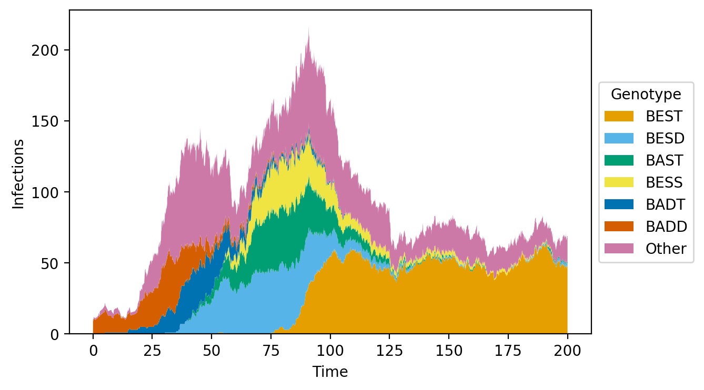
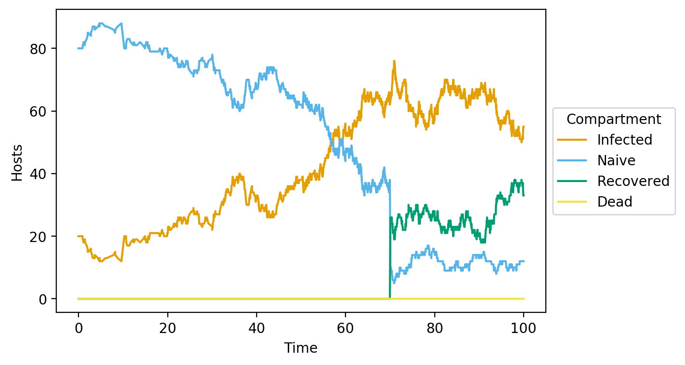
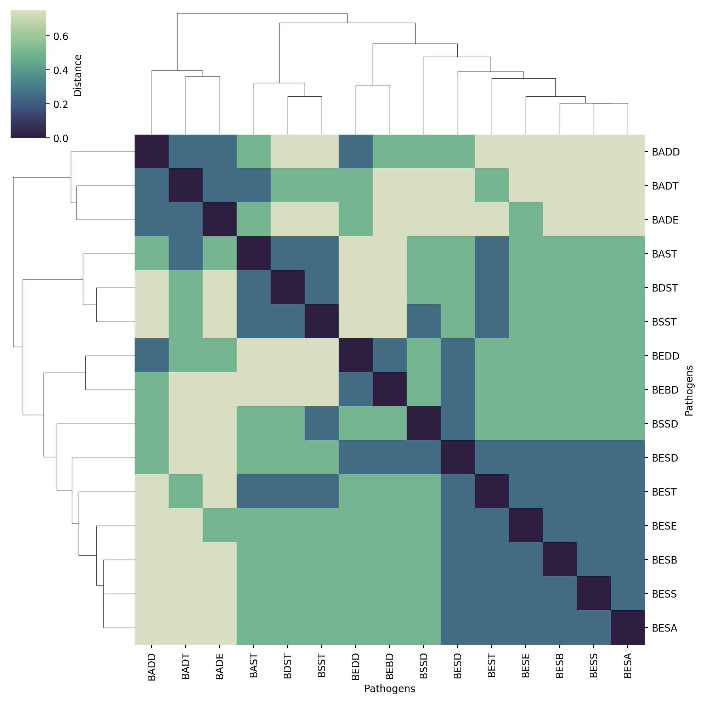

Opqua
=====

**opqua** (opkua, upkua)
\[[Chibcha/muysccubun](https://en.wikipedia.org/wiki/Chibcha_language)\]

**I.** *noun*. ailment, disease, illness

**II.** *noun*. cause, reason \[*for which something occurs*\]

_Taken from D. F. Gómez Aldana's
[muysca-spanish dictionary](http://muysca.cubun.org/opqua)_.

## Contents
- [About](#about)
- [Example Plots](#example-plots)
- [Requirements and Installation](#requirements-and-installation)
- [Usage](#usage)
- [Model Methods List](#model-class-methods-list)

## About

### Opqua is an epidemiological modeling framework for pathogen population genetics and evolution.

Opqua stochastically simulates pathogens with distinct, evolving genotypes that
spread through populations of hosts that can have specific immune profiles.

Opqua is a useful tool to test out scenarios, explore hypotheses, and make
predictions about the relationship between pathogen evolution and epidemiology.

Among many things, Opqua can model
- host-host and vector-borne transmission,
- host recovery and death
- competition and evolution of pathogen strains across arbitrary adaptive
landscapes
- metapopulations with complex structure
- interventions altering demographic, ecological, or evolutionary parameters
- treatment and immunization of hosts or vectors

Opqua is developed by [Pablo Cárdenas](https://pablo-cardenas.com) and Mauricio
Santos-Vega.
Follow their science antics on Twitter at
[@pcr_guy](https://twitter.com/pcr_guy) and
[@msantosvega](https://twitter.com/msantosvega).

Opqua is [available on PyPI](https://pypi.org/project/opqua/) and is distributed
under an [MIT License](https://choosealicense.com/licenses/mit/).

## Example Plots

These are some of the plots Opqua is able to produce, but you can output the
raw simulation data yourself to make your own analyses and plots. These are all
taken from the examples in the `examples` folder.

#### Population genetic composition plots for pathogens
Here, an optimal pathogen genome arises and outcompetes all others.


#### Host/vector compartment plots
Here "Recovered" denotes immunized hosts.


#### Plots of a host/vector compartment across different populations in a metapopulation


#### Pathogen phylogenies


## Requirements and Installation

Opqua runs on Python. A good place to get the latest version it if you don't
have it is [Anaconda](https://www.anaconda.com/distribution/).

Opqua is [available on PyPI](https://pypi.org/project/opqua/) to install
through `pip`, as explained below.

If you haven't yet, [install pip](https://pip.pypa.io/en/stable/installing/):
```bash
curl https://bootstrap.pypa.io/get-pip.py -o get-pip.py
python get-pip.py
```

Install opqua by running

```bash
pip install opqua
```

## Usage

All usage is handled through the Opqua `Model` class.
The Model class contains populations, setups, and interventions to be used
in simulation. It also contains groups of hosts/vectors for manipulations and
stores model history as snapshots for each time point.

To use it, import the class as

```python
from opqua.model import Model
```

For example usage, have a look at the `examples` folder.

### Model attributes
- populations -- dictionary with keys=population IDs, values=Population
    objects
- setups -- dictionary with keys=setup IDs, values=Setup objects
- interventions -- contains model interventions in the order they will occur
- groups -- dictionary with keys=group IDs, values=lists of hosts/vectors
- history -- dictionary with keys=time values, values=Model objects that
    are snapshots of Model at that timepoint

### Model class methods list

#### Model Initialization and Simulation

- [newSetup](#newsetup) -- creates a new Setup, save it in setups dict under
given name
- [newIntervention](#newintervention) -- creates a new intervention executed
during simulation
- [run](#run) -- simulates model for a specified length of time

#### Data Output and Plotting ###

- [saveToDataFrame](#savetodataframe) -- saves status of model to data frame,
writes to file
- [getPathogens](#getpathogens) -- creates data frame with counts for all
pathogen genomes
- [getProtections](#getprotections) -- creates data frame with counts for all
protection sequences
- [populationsPlot](#populationsplot) -- plots aggregated totals per
population across time
- [compartmentPlot](#compartmentplot) -- plots number of naive, infected,
recovered, dead hosts/vectors vs time
- [compositionPlot](#compositionplot) -- plots counts for pathogen genomes or
resistance vs. time

#### Model interventions ###

##### Make and connect populations ####
- [newPopulation](#newpopulation) -- create a new Population object with
setup parameters
- [linkPopulations](#linkpopulations) -- set migration rate from one
population towards another
- [createInterconnectedPopulations](#createinterconnectedpopulations) --
create new populations, link all of them to each other

##### Modify population parameters ####
- [setSetup](#setsetup) -- assigns a given set of parameters to this
population

##### Manipulate hosts and vectors in population ####
- [newHostGroup](#newhostgroup) -- returns a list of random (healthy or any)
hosts
- [newVectorGroup](#newvectorgroup) -- returns a list of random (healthy or
  any) vectors
- [addHosts](#addhosts) -- adds hosts to the population
- [addVectors](#addvectors) -- adds vectors to the population
- [removeHosts](#removehosts) -- removes hosts from the population
- [removeVectors](#removevectors) -- removes vectors from the population
- [addPathogensToHosts](#addpathogenstohosts) -- adds pathogens with
specified genomes to hosts
- [addPathogensToVectors](#addpathogenstovectors) -- adds pathogens with
specified genomes to vectors
- [treatHosts](#treathosts) -- removes infections susceptible to given
treatment from hosts
- [treatVectors](#treatvectors) -- removes infections susceptible to
treatment from vectors
- [protectHosts](#protecthosts) -- adds protection sequence to hosts
- [protectVectors](#protectvectors) -- adds protection sequence to vectors


#### Preset fitness functions ###

- [stabilizingSelection](#stabilizingselection) -- evaluates genome fitness
by decreasing with distance from optimal sequence
- [disruptiveSelection](#disruptiveselection) -- evaluates genome fitness by
increasing with distance from worst sequence

### Detailed Model method list

#### Model

```python
Model()
```

Class constructor; create a new Model object.

#### newSetup

```python
newSetup()
```

Create a new Setup, save it in setups dict under given name.

Two preset setups exist: "vector-borne" and "host-host". You may select
one of the preset setups with the preset keyword argument and then
modify individual parameters with additional keyword arguments, without
having to specify all of them.

Preset parameter setups:

"vector-borne":

```python
num_loci = 10
possible_alleles = 'ATCG'
fitnessHost = (lambda g: 1)
fitnessVector = (lambda g: 1)
contact_rate_host_vector = 1e1
contact_rate_host_host = 0
mean_inoculum_host = 1e2
mean_inoculum_vector = 1e2
recovery_rate_host = 1e-1
recovery_rate_vector = 1e-2
recombine_in_host = 0
recombine_in_vector = 1e-2
mutate_in_host = 1e-6
mutate_in_vector = 0
death_rate_host = 0
death_rate_vector = 0
protection_upon_recovery_host = None
protection_upon_recovery_vector = None
```

"host-host":

```python
num_loci = 10
possible_alleles = 'ATCG'
fitnessHost = (lambda g: 1)
fitnessVector = (lambda g: 1)
contact_rate_host_vector = 0
contact_rate_host_host = 2e1
mean_inoculum_host = 1e1
mean_inoculum_vector = 0
recovery_rate_host = 1e-1
recovery_rate_vector = 1e1
recombine_in_host = 1e-3
recombine_in_vector = 0
mutate_in_host = 1e-6
mutate_in_vector = 0
death_rate_host = 0
death_rate_vector = 0
protection_upon_recovery_host = None
protection_upon_recovery_vector = None
```

_Arguments:_
- name -- name of setup to be used as a key in model setups dictionary

_Keyword Arguments:_
- preset -- preset setup to be used: "vector-borne" or "host-host", if
None, must define all other keyword arguments (default None; None or
String)
- num_loci -- length of each pathogen genome string (int > 0)
possible_alleles -- set of possible characters in all genome string, or
at each position in genome string (String or list of Strings with
- num_loci elements)
- fitnessHost -- relative fitness in head-to-head competition within host
(number >= 0)
- fitnessVector -- relative fitness in head-to-head competition within
vector (number >= 0)
- contact_rate_host_vector -- rate of host-vector contact events, not
necessarily transmission, assumes constant population density;
evts/time (number >= 0)
- contact_rate_host_host -- rate of host-host contact events, not
necessarily transmission, assumes constant population density;
evts/time (number >= 0)
- mean_inoculum_host -- mean number of pathogens that are transmitted from
a vector or host into a new host during a contact event (int >= 0)
- mean_inoculum_vector -- mean number of pathogens that are transmitted
from a host to a vector during a contact event (int >= 0)
- recovery_rate_host -- rate at which hosts clear all pathogens;
1/time (number >= 0)
- recovery_rate_vector -- rate at which vectors clear all pathogens
1/time (number >= 0)
- recombine_in_host -- rate at which recombination occurs in host;
evts/time (number >= 0)
- recombine_in_vector -- rate at which recombination occurs in vector;
evts/time (number >= 0)
- mutate_in_host -- rate at which mutation occurs in host; evts/time
(number >= 0)
- mutate_in_vector -- rate at which mutation occurs in vector; evts/time
(number >= 0)
- death_rate_host -- infected host death rate; 1/time (number >= 0)
- death_rate_vector -- infected vector death rate; 1/time (number >= 0)
- protection_upon_recovery_host -- defines indexes in genome string that
define substring to be added to host protection sequences after
recovery (None or array-like of length 2 with int 0-num_loci)
- protection_upon_recovery_vector -- defines indexes in genome string that
define substring to be added to vector protection sequences after
recovery (None or array-like of length 2 with int 0-num_loci)

#### newIntervention

```python
newIntervention(time, function, args)
```

Create a new intervention to be carried out at a specific time.

_Arguments:_
- time -- time at which intervention will take place (number)
- function -- intervention to be carried out (method of class Model)
- args -- contains arguments for function in positinal order (array-like)

#### run

```python
run(t0,tf)
```

Simulate model for a specified time between two time points.

Simulates a time series using the Gillespie algorithm.

Saves a dictionary containing model state history, with keys=times and
values=Model objects with model snapshot at that time point under this
model's history attribute.

_Arguments:_
- t0 -- initial time point to start simulation at (number)
- tf -- initial time point to end simulation at (number)

#### saveToDataFrame

```python
saveToDataFrame(save_to_file,n_cores=0)
```

Save status of model to dataframe, write to file location given.

Creates a pandas Dataframe in long format with the given model history,
with one host or vector per simulation time in each row, and columns:
- Time - simulation time of entry
- Population - ID of this host/vector's population
- Organism - host/vector
- ID - ID of host/vector
- Pathogens - all genomes present in this host/vector separated by ;
- Protection - all genomes present in this host/vector separated by ;
- Alive - whether host/vector is alive at this time, True/False

_Arguments:_
- save_to_file -- file path and name to save model data under (String)

_Keyword Arguments:_
- n_cores -- number of cores to parallelize file export across, if 0, all
    cores available are used (default 0; int)

_Returns:_
- pandas dataframe with model history as described above

#### getPathogens

```python
getPathogens(dat, save_to_file="")
```


Create Dataframe with counts for all pathogen genomes in data.

Returns sorted pandas Dataframe with counts for occurrences of all pathogen
genomes in data passed.

_Arguments:_
- data -- dataframe with model history as produced by saveToDf function

_Keyword Arguments:_
- save_to_file -- file path and name to save model data under, no saving
    occurs if empty string (default ''; String)

_Returns:_
- pandas dataframe with Series as described above

#### getProtections

```python
getProtections(dat, save_to_file="")
```


Create Dataframe with counts for all protection sequences in data.

Returns sorted pandas Dataframe with counts for occurrences of all
protection sequences in data passed.

_Arguments:_
- data -- dataframe with model history as produced by saveToDf function

_Keyword Arguments:_
- save_to_file -- file path and name to save model data under, no saving
- occurs if empty string (default ''; String)

_Returns:_
- pandas dataframe with Series as described above

#### populationsPlot

```python
populationsPlot(
file_name, data, compartment='Infected',
hosts=True, vectors=False, num_top_populations=7,
track_specific_populations=[], save_data_to_file="",
x_label='Time', y_label='Hosts', figsize=(8, 4), dpi=200,
palette=CB_PALETTE, stacked=False)
```


Create plot with aggregated totals per population across time.

Creates a line or stacked line plot with dynamics of a compartment
across populations in the model, with one line for each population.

A host or vector is considered part of the recovered compartment
if it has protection sequences of any kind and is not infected.

_Arguments:_
- file_name -- file path, name, and extension to save plot under (String)
- data -- dataframe with model history as produced by saveToDf function
(DataFrame)

_Keyword Arguments:_
- compartment -- subset of hosts/vectors to count totals of, can be either
'Naive','Infected','Recovered', or 'Dead' (default 'Infected';
String)
- hosts -- whether to count hosts (default True, Boolean)
- vectors -- whether to count vectors (default False, Boolean)
- num_top_populations -- how many populations to count separately and
include as columns, remainder will be counted under column "Other";
if <0, includes all populations in model (default 7; int)
- track_specific_populations -- contains IDs of specific populations to
have as a separate column if not part of the top num_top_populations
populations (list of Strings)
- save_data_to_file -- file path and name to save model plot data under,
no saving occurs if empty string (default ''; String)
- x_label -- X axis title (default 'Time', String)
- y_label -- Y axis title (default 'Hosts', String)
- legend_title -- legend title (default 'Population', String)
- legend_values -- labels for each trace, if empty list, uses population
IDs (default empty list, list of Strings)
- figsize -- dimensions of figure (default (8,4), array-like of two ints)
- dpi -- figure resolution (default 200, int)
- palette -- color palette to use for traces (default CB_PALETTE, list of
color Strings)
- stacked -- whether to draw a regular line plot or a stacked one (default
False, Boolean)

_Returns:_
- axis object for plot with model population dynamics as described above

#### compartmentPlot

```python
compartmentPlot(
file_name, data, populations=[], hosts=True, vectors=False,
save_data_to_file="", x_label='Time', y_label='Hosts',
figsize=(8, 4), dpi=200, palette=CB_PALETTE, stacked=False)
```


Create plot with number of naive, infected, recovered, dead hosts/vectors vs.
time.

Creates a line or stacked line plot with dynamics of all compartments
(naive, infected, recovered, dead) across selected populations in the
model, with one line for each compartment.

A host or vector is considered recovered if it has protection sequences of any
kind and is not infected.

_Arguments:_
- file_name -- file path, name, and extension to save plot under (String)
- data -- dataframe with model history as produced by saveToDf function
(DataFrame)

_Keyword Arguments:_
- populations -- IDs of populations to include in analysis; if empty, uses
- all populations in model (default empty list; list of Strings)
- hosts -- whether to count hosts (default True, Boolean)
- vectors -- whether to count vectors (default False, Boolean)
- save_data_to_file -- file path and name to save model data under, no saving
- occurs if empty string (default ''; String)
- x_label -- X axis title (default 'Time', String)
- y_label -- Y axis title (default 'Hosts', String)
- legend_title -- legend title (default 'Population', String)
- legend_values -- labels for each trace, if empty list, uses population
IDs (default empty list, list of Strings)
- figsize -- dimensions of figure (default (8,4), array-like of two ints)
- dpi -- figure resolution (default 200, int)
- palette -- color palette to use for traces (default CB_PALETTE, list of
color Strings)
- stacked -- whether to draw a regular line plot or a stacked one (default
False, Boolean)

_Returns:_
- axis object for plot with model compartment dynamics as described above

#### compositionPlot

```python
compositionPlot(
file_name, data, populations=[],
type_of_composition='Pathogens', hosts=True, vectors=False,
num_top_sequences=7, track_specific_sequences=[],
save_data_to_file="", x_label='Time', y_label='Infections',
figsize=(8, 4), dpi=200, palette=CB_PALETTE, stacked=True)
```


Create plot with counts for pathogen genomes or resistance vs. time.

Creates a line or stacked line plot with dynamics of the pathogen
strains or protection sequences across selected populations in the
model, with one line for each pathogen genome or protection sequence
being shown.s

Of note: sum of totals for all sequences in one time point does not
necessarily equal the number of infected hosts and/or vectors, given
multiple infections in the same host/vector are counted separately.

_Arguments:_
- file_name -- file path, name, and extension to save plot under (String)
- data -- dataframe with model history as produced by saveToDf function

_Keyword Arguments:_
- populations -- IDs of populations to include in analysis; if empty, uses
- all populations in model (default empty list; list of Strings)
- type_of_composition -- field of data to count totals of, can be either
'Pathogens' or 'Protection' (default 'Pathogens'; String)
- hosts -- whether to count hosts (default True, Boolean)
- vectors -- whether to count vectors (default False, Boolean)
- num_top_sequences -- how many sequences to count separately and include
as columns, remainder will be counted under column "Other"; if <0,
includes all genomes in model (default 7; int)
- track_specific_sequences -- contains specific sequences to have
as a separate column if not part of the top num_top_sequences
sequences (list of Strings)
- save_data_to_file -- file path and name to save model data under, no saving
occurs if empty string (default ''; String)
- x_label -- X axis title (default 'Time', String)
- y_label -- Y axis title (default 'Hosts', String)
- legend_title -- legend title (default 'Population', String)
- legend_values -- labels for each trace, if empty list, uses population
IDs (default empty list, list of Strings)
- figsize -- dimensions of figure (default (8,4), array-like of two ints)
- dpi -- figure resolution (default 200, int)
- palette -- color palette to use for traces (default CB_PALETTE, list of
color Strings)
- stacked -- whether to draw a regular line plot or a stacked one (default
False, Boolean)

_Returns:_
- axis object for plot with model sequence composition dynamics as
described

### clustermap

```python
clustermap(self, file_name, data, num_top_sequences=-1,
track_specific_sequences=[], seq_names=[], n_cores=0, method='weighted',
metric='euclidean',save_data_to_file="", legend_title='Distance',
legend_values=[], figsize=(10,10), dpi=200, color_map=DEF_CMAP):
```

Create a heatmap and dendrogram for pathogen genomes in data passed.

Arguments:
- file_name -- file path, name, and extension to save plot under (String)
- data -- dataframe with model history as produced by saveToDf function

Keyword arguments:
- num_top_sequences -- how many sequences to include in matrix; if <0,
includes all genomes in data passed (default -1; int)
- track_specific_sequences -- contains specific sequences to include in
matrixif not part of the top num_top_sequences sequences (default
empty list; list of Strings)
- seq_names -- list with names to be used for sequence labels in matrix
must be of same length as number of sequences to be displayed; if
empty, uses sequences themselves (default empty list; list of
Strings)
- n_cores -- number of cores to parallelize distance compute across, if 0,
all cores available are used (default 0; int)
- method -- clustering algorithm to use with seaborn clustermap (default
'weighted'; String)
- metric -- distance metric to use with seaborn clustermap (default
'euclidean'; String)
- save_data_to_file -- file path and name to save model data under, no
saving occurs if empty string (default ''; String)
- legend_title -- legend title (default 'Distance', String)
- figsize -- dimensions of figure (default (8,4), array-like of two ints)
- dpi -- figure resolution (default 200, int)
- color_map -- color map to use for traces (default DEF_CMAP, cmap object)

Returns:
- figure object for plot with heatmap and dendrogram as described

#### newPopulation

```python
newPopulation(id, setup_name, num_hosts=100, num_vectors=100)
```


Create a new Population object with setup parameters.

If population ID is already in use, appends _2 to it

_Arguments:_
- id -- unique identifier for this population in the model (String)
- setup_name -- setup object with parameters for this population (Setup)

_Keyword Arguments:_
- num_hosts -- number of hosts to initialize population with (default 100;
int)
- num_vectors -- number of hosts to initialize population with (default
100; int)

#### linkPopulations

```python
linkPopulations(pop1_id, pop2_id, rate)
```


Set migration rate from one population towards another.

_Arguments:_
- neighbor -- population towards which migration rate will be specified
(Population)
- rate -- migration rate from this population to the neighbor; evts/time
(number)

#### createInterconnectedPopulations

```python
createInterconnectedPopulations(
num_populations, migration_rate, id_prefix, setup_name,
num_hosts=100, num_vectors=100)
```


Create new populations, link all of them to each other.

All populations in this cluster are linked with the same migration rate,
starting number of hosts and vectors, and setup parameters. Their IDs
are numbered onto prefix given as 'id_prefix_0', 'id_prefix_1',
'id_prefix_2', etc.

_Arguments:_
- num_populations -- number of populations to be created (int)
- migration_rate -- migration rate between populations; evts/time (number)
- id_prefix -- prefix for IDs to be used for this population in the model,
(String)
- setup_name -- setup object with parameters for all populations (Setup)

_Keyword Arguments:_
- num_hosts -- number of hosts to initialize population with (default 100;
int)
- num_vectors -- number of hosts to initialize population with (default
100; int)

#### newHostGroup

```python
newHostGroup(pop_id, group_id, num_hosts, healthy=False)
```


Return a list of random (healthy or any) hosts in population.

_Arguments:_
- pop_id -- ID of population to be modified (String)
- group_id -- ID to call this group by (String)
- num_vectors -- number of vectors to be sampled randomly (int)

_Keyword Arguments:_
- healthy -- whether to sample healthy hosts only (default True; Boolean)

_Returns:_
- list containing sampled hosts

#### newVectorGroup

```python
newVectorGroup(pop_id, group_id, num_vectors, healthy=False)
```


Return a list of random (healthy or any) vectors in population.

_Arguments:_
- pop_id -- ID of population to be modified (String)
- group_id -- ID to call this group by (String)
- num_vectors -- number of vectors to be sampled randomly (int)

_Keyword Arguments:_
- healthy -- whether to sample healthy vectors only (default True;
Boolean)

_Returns:_
- list containing sampled vectors

#### addHosts

```python
addHosts(pop_id, num_hosts)
```


Add a number of healthy hosts to population, return list with them.

_Arguments:_
- pop_id -- ID of population to be modified (String)
- num_hosts -- number of hosts to be added (int)

_Returns:_
list containing new hosts

#### addVectors

```python
addVectors(pop_id, num_vectors)
```


Add a number of healthy vectors to population, return list with them.

_Arguments:_
- pop_id -- ID of population to be modified (String)
- num_vectors -- number of vectors to be added (int)

_Returns:_
- list containing new vectors

#### removeHosts

```python
removeHosts(pop_id, num_hosts_or_list)
```


Remove a number of specified or random hosts from population.

_Arguments:_
- pop_id -- ID of population to be modified (String)
- num_hosts_or_list -- number of hosts to be sampled randomly for removal
or list of hosts to be removed, must be hosts in this population
(int or list of Hosts)

#### removeVectors

```python
removeVectors(pop_id, num_vectors_or_list)
```


Remove a number of specified or random vectors from population.

_Arguments:_
- pop_id -- ID of population to be modified (String)
- num_vectors_or_list -- number of vectors to be sampled randomly for
removal or list of vectors to be removed, must be vectors in this
population (int or list of Vectors)

#### addPathogensToHosts

```python
addPathogensToHosts(pop_id, genomes_numbers, group_id="")
```


Add specified pathogens to random hosts, optionally from a list.

_Arguments:_
- pop_id -- ID of population to be modified (String)
- genomes_numbers -- dictionary containing pathogen genomes to add as keys
and number of hosts each one will be added to as values (dict with
keys=Strings, values=int)

_Keyword Arguments:_
- group_id -- ID of group to sample hosts to sample from, if empty, samples from
whole population (default empty String; empty)

#### addPathogensToVectors

```python
addPathogensToVectors(pop_id, genomes_numbers, group_id="")
```


Add specified pathogens to random vectors, optionally from a list.

_Arguments:_
- pop_id -- ID of population to be modified (String)
- genomes_numbers -- dictionary containing pathogen genomes to add as keys
and number of vectors each one will be added to as values (dict with
keys=Strings, values=int)

_Keyword Arguments:_
- group_id -- ID of group to sample vectors to sample from, if empty, samples
from whole population (default empty String; empty)

#### treatHosts

```python
treatHosts(pop_id, frac_hosts, resistance_seqs, group_id="")
```


Treat random fraction of infected hosts against some infection.

Removes all infections with genotypes susceptible to given treatment.
Pathogens are removed if they are missing at least one of the sequences
in resistance_seqs from their genome. Removes this organism from
population infected list and adds to healthy list if appropriate.

_Arguments:_
- pop_id -- ID of population to be modified (String)
- frac_hosts -- fraction of hosts considered to be randomly selected
(number between 0 and 1)
- resistance_seqs -- contains sequences required for treatment resistance
(list of Strings)

_Keyword Arguments:_
- group_id -- ID of group to sample hosts to sample from, if empty, samples from
whole population (default empty String; empty)

#### treatVectors

```python
treatVectors(pop_id, frac_vectors, resistance_seqs, group_id="")
```


Treat random fraction of infected vectors agains some infection.

Removes all infections with genotypes susceptible to given treatment.
Pathogens are removed if they are missing at least one of the sequences
in resistance_seqs from their genome. Removes this organism from
population infected list and adds to healthy list if appropriate.

_Arguments:_
- pop_id -- ID of population to be modified (String)
- frac_vectors -- fraction of vectors considered to be randomly selected
(number between 0 and 1)
- resistance_seqs -- contains sequences required for treatment resistance
(list of Strings)

_Keyword Arguments:_
- group_id -- ID of group to sample vectors to sample from, if empty, samples
from whole population (default empty String; empty)

#### protectHosts

```python
protectHosts(pop_id, frac_hosts, protection_sequence, group_id="")
```


Protect a random fraction of infected hosts against some infection.

Adds protection sequence specified to a random fraction of the hosts
specified. Does not cure them if they are already infected.

_Arguments:_
- pop_id -- ID of population to be modified (String)
- frac_hosts -- fraction of hosts considered to be randomly selected
(number between 0 and 1)
- protection_sequence -- sequence against which to protect (String)

_Keyword Arguments:_
- group_id -- ID of group to sample hosts to sample from, if empty, samples from
whole population (default empty String; empty)

#### protectVectors

```python
protectVectors(pop_id, frac_vectors, protection_sequence, group_id="")
```


Protect a random fraction of infected vectors against some infection.

Adds protection sequence specified to a random fraction of the vectors
specified. Does not cure them if they are already infected.

_Arguments:_
- pop_id -- ID of population to be modified (String)
- frac_vectors -- fraction of vectors considered to be randomly selected
(number between 0 and 1)
- protection_sequence -- sequence against which to protect (String)

_Keyword Arguments:_
- group_id -- ID of group to sample vectors to sample from, if empty, samples
from whole population (default empty String; empty)

#### setSetup

```python
setSetup(pop_id, setup_id)
```


Assign parameters stored in Setup object to this population.

_Arguments:_
- pop_id -- ID of population to be modified (String)
- setup_id -- ID of setup to be assigned (String)

#### stabilizingSelection

```python
stabilizingSelection(genome, optimal_genome, min_fitness)
```


Evaluate genome fitness by decreasing with distance from optimal seq.

A purifying selection fitness function based on exponential decay of
fitness as genomes move away from the optimal sequence. Distance is
measured as percent Hamming distance from an optimal genome sequence.

_Arguments:_
- genome -- the genome to be evaluated (String)
- optimal_genome -- the genome sequence to measure distance against, has
fitness of 1 (String)
- min_fitness -- minimum fitness value at maximum distance from optimal
genome (number > 0)

Return:
- fitness value of genome (number)

#### disruptiveSelection

```python
disruptiveSelection(genome, worst_genome, min_fitness)
```


Evaluate genome fitness by increasing with distance from worst seq.

A purifying selection fitness function based on exponential decay of
fitness as genomes move closer to the worst possible sequence. Distance
is measured as Hamming distance from the worst possible genome sequence.

_Arguments:_
- genome -- the genome to be evalued (String)
- optimal_genome -- the genome sequence to measure distance against, has
fitness of min_fitness (String)
- min_fitness -- fitness value of worst possible genome (number > 0)

Return:
- fitness value of genome (number)
